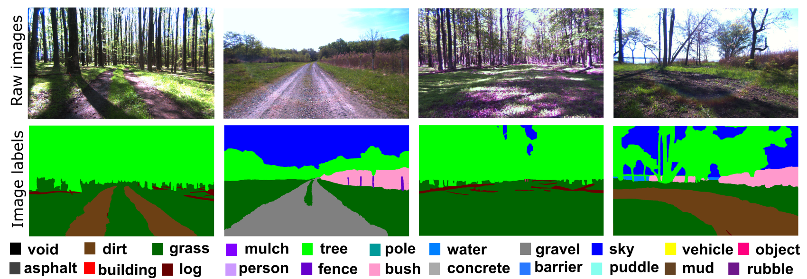
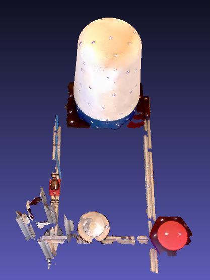
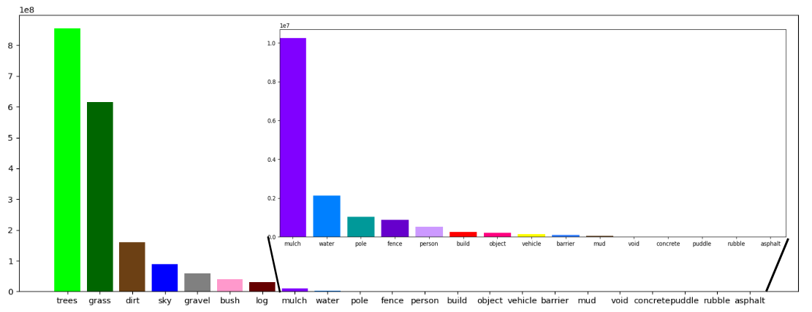

<h align="center">
<h1>The Great Outdoors Dataset: Off-Road Multi-Modal Dataset</h1>
</h>
<p align="center">
<a href="https://www.tamu.edu/"></a>&emsp;&emsp;&emsp;&emsp;<a href="https://www.arl.army.mil/"></a></p>
<p align="center">
 Peng Jiang<sup>1</sup>, Philip Osteen<sup>2</sup>, Maggie Wigness<sup>2</sup> and Srikanth Saripalli<sup>1</sup><br>
1. <a href="https://www.tamu.edu/">Texas A&M University; </a>&emsp;2. <a href="https://www.arl.army.mil/">CCDC Army Research Laboratory</a><br>
<!--a href="https://unmannedlab.github.io/research/RELLIS-3D">[Website]</a> <a href="https://arxiv.org/abs/2011.12954">[Paper]</a> <a href="https://github.com/unmannedlab/RELLIS-3D">[Github]</a--> 
</p>

<!--## Updates
* 11/26/2020 v1.0 release
* 02/25/2021 improve camera and lidar calibration parameter
* 03/04/2021 update ROS bag with new tf (v1.1 release)
* 06/14/2021 fix missing labels of point cloud and fix wrong poses
* 01/24/2022 add Velodyne point clouds in kitti format and labels transfered from Ouster
-->
## Overview
The Great Outdoors Dataset: Off-Road Multi-Modal Dataset is a comprehensive resource aimed at advancing autonomous navigation research in challenging off-road environments. Collected using an unmanned ground vehicle (UGV) designed for unstructured terrain, this dataset offers a rich combination of sensor data to support robust and safe navigation. The sensor setup includes a 64-channel LiDAR for detailed 3D point cloud generation, multiple RGB cameras for high-resolution visual capture, and a thermal camera for infrared imaging in low-visibility or night-time conditions. In addition, the dataset features data from an inertial navigation system (INS) that provides accurate motion and orientation measurements, a 2D mmWave radar for enhanced perception in adverse weather conditions, and an RTK GPS system for precise geolocation. The Great Outdoors Dataset places a strong emphasis on semantic scene understanding, addressing the gap in off-road autonomy research by offering multimodal data with annotated labels for 3D semantic segmentation. Unlike many existing datasets that focus on urban environments, this dataset is specifically tailored for off-road applications, providing a crucial resource for the development of advanced machine learning models and sensor fusion techniques. By building on the foundation of [RELLIS-3D](https://github.com/unmannedlab/RELLIS-3D), it is designed to push the boundaries of autonomous navigation in unstructured environments, enabling the development of algorithms that can effectively navigate and perceive the complex dynamics of off-road settings.




### Recording Platform
* [Clearpath Robobtics Warthog](https://clearpathrobotics.com/warthog-unmanned-ground-vehicle-robot/)

### Sensor Setup
* 64 channels Lidar: [Ouster OS1](https://ouster.com/products/os1-lidar-sensor)
* 3 RGB Camera: [Basler acA1920-50gc](https://www.baslerweb.com/en/products/cameras/area-scan-cameras/ace/aca1920-50gc/) + [Edmund Optics 16mm/F1.8 86-571](https://www.edmundoptics.com/p/16mm-focal-length-hp-series-fixed-focal-length-lens/28990/)
* Thermal Camera: [FLIR Boson 640](https://www.flir.com/products/boson/?model=20640A032&vertical=lwir&segment=oem)
* Inertial Navigation System (IMU/GPS): [MicroStrain 3DM-GX5-AHRS](http://www.microstrain.com/inertial-sensors/3dm-gx5-25)
* 2D mmwave RADAR: [Navtech CTS350-X](https://navtechradar.com/radar-solutions/radar-for-intelligent-transport-solutions/clearway-technical-specification/)
* RTK GPS: [Saprkfun RTK Facet](https://www.sparkfun.com/products/19984)



3D scan of the sensor setup.([Download](https://drive.google.com/file/d/1lTc4GO6WiOHxn7cqnY3baj5yh7qnQ5oX/view?usp=sharing))

## Folder structure

<pre>
The Great Outdoors Dataset
├── pt_test.lst
├── pt_val.lst
├── pt_train.lst
├── 00000
      ├── os1_cloud_node_kitti_bin/             -- directory containing ".bin" files with Ouster 64-Channels point clouds.  
      ├── nav_radar_node/       -- directory containing radar polar images.
      ├── pylon_camera_node/    -- directory containing ".png" files from the color camera.  
      ├── pylon_camera_node_label_color -- color image lable
      ├── pylon_camera_node_label_id -- id image lable
      ├──  lwir_camera_node/    -- directory containing ".png" files from the thermal camera.  
      ├── lwir_camera_node_label_color -- color image lable
      ├── lwir_camera_node_label_id -- id image lable
      └── poses.txt             -- file containing the poses of every scan.
</pre>

<!--## Download Link on BaiDu Pan:
链接: https://pan.baidu.com/s/1akqSm7mpIMyUJhn_qwg3-w?pwd=4gk3 提取码: 4gk3 复制这段内容后打开百度网盘手机App，操作更方便哦
-->
## Annotated Data:
### Ontology:
To provide multi-modal data for enhancing autonomous off-road navigation, we developed an ontology of object and terrain classes that extends the foundation of the [RELLIS-3D dataset](https://github.com/unmannedlab/RELLIS-3D), while incorporating additional terrain and object categories specific to our dataset. Notably, our sequences introduce new classes such as gravel and mulch, which were absent in RELLIS-3D. Overall, the dataset encompasses 22 distinct classes, including trees, grass, dirt, sky, gravel, bush, mulch, water, poles, fences, persons, buildings, objects, vehicles, barriers, mud, concrete, puddles, rubble, asphalt, and a void class. This expanded ontology provides a more comprehensive understanding of off-road environments, offering enriched data for advanced semantic segmentation and improved performance in challenging, unstructured terrains.

**Ontology Definition** ([Ontology](./images/GOD_Ontology.png))

### Images Statics:


<!--
<span style="color:red"> Note: Due to the limitation of Google Drive, the downloads might be constrained. Please wait for 24h and try again. If you still can't access the file, please email maskjp@tamu.edu with the title "RELLIS-3D Access Request".</span>.
-->

### RGB Image Download: 

**Image with Annotation Examples** ([Download](https://drive.google.com/file/d/1oi5KpBYXefvMpiUzrVE1BWcPfmMieTdx/view?usp=sharing))

**Full Images** ([Download](https://drive.google.com/file/d/1Y_XHZw6BeuqwD280K7xw4eapNRpSKXA5/view?usp=sharing))

**Full Image Annotations Color Format** ([Download](https://drive.google.com/file/d/1qc4J1DgiWU0MsUhUhyX0p8sQROoVb4uZ/view?usp=sharing))

**Full Image Annotations ID Format** ([Download](https://drive.google.com/file/d/1VehRXZ_Bw4DolGVvqVk4qr_pmbUXYgQA/view?usp=sharing))

### Thermal Image Download: 

**Full Images** ([Download](https://drive.google.com/file/d/1kTwL7O_v4Qc8WpzpT7416VXgENYm1ZK-/view?usp=sharing))

**Full Image Annotations Color Format** ([Download](https://drive.google.com/file/d/1g6Hf7-wg3JqQMDufhpHCyGK-cPrkQ7Ck/view?usp=sharing))

**Full Image Annotations ID Format** ([Download](https://drive.google.com/file/d/1u_cRN-SkU2b_M5pWCRU0rL4_RkCTUTsA/view?usp=sharing))

### LiDAR Data
**Synced LiDAR Pointcloud Semantic-KITTI Format** ([Download]())

### RADAR Data
**Synced RADAR Polar Images** ([Download](https://drive.google.com/file/d/1KC56g3GriVsIA5rkKCFA7mqBWeuZL9PQ/view?usp=sharing))
<!--
**Image Split File** ([44KB](https://drive.google.com/file/d/1zHmnVaItcYJAWat3Yti1W_5Nfux194WQ/view?usp=sharing))
-->
<!--
### LiDAR Scans Statics:


### LiDAR Download: 

**Ouster LiDAR with Annotation Examples** ([Download 24MB](https://drive.google.com/file/d/1QikPnpmxneyCuwefr6m50fBOSB2ny4LC/view?usp=sharing)) 

**Ouster LiDAR with Color Annotation PLY Format** ([Download 26GB](https://drive.google.com/file/d/1BZWrPOeLhbVItdN0xhzolfsABr6ymsRr/view?usp=sharing))

The header of the PLY file is described as followed:
```
element vertex
property float x
property float y
property float z
property float intensity
property uint t
property ushort reflectivity
property uchar ring
property ushort noise
property uint range
property uchar label
property uchar red
property uchar green
property uchar blue
```
To visualize the color of the ply file, please use [CloudCompare](https://www.danielgm.net/cc/) or [Open3D](http://www.open3d.org/). Meshlab has problem to visualize the color.


**Ouster LiDAR SemanticKITTI Format** ([Download 14GB](https://drive.google.com/file/d/1lDSVRf_kZrD0zHHMsKJ0V1GN9QATR4wH/view?usp=sharing))

To visualize the datasets using the SemanticKITTI tools, please use this fork: [https://github.com/unmannedlab/point_labeler](https://github.com/unmannedlab/point_labeler)

**Ouster LiDAR Annotation SemanticKITTI Format** ([Download 174MB](https://drive.google.com/file/d/12bsblHXtob60KrjV7lGXUQTdC5PhV8Er/view?usp=sharing))

**Ouster LiDAR Scan Poses files** ([Download 174MB](https://drive.google.com/file/d/1V3PT_NJhA41N7TBLp5AbW31d0ztQDQOX/view?usp=sharing))

**Ouster LiDAR Split File** ([75KB](https://drive.google.com/file/d/1raQJPySyqDaHpc53KPnJVl3Bln6HlcVS/view?usp=sharing)) 


**Velodyne LiDAR SemanticKITTI Format** ([Download 5.58GB](https://drive.google.com/file/d/1PiQgPQtJJZIpXumuHSig5Y6kxhAzz1cz/view?usp=sharing))


**Velodyne LiDAR Annotation SemanticKITTI Format** ([Download 143.6MB](https://drive.google.com/file/d/1n-9FkpiH4QUP7n0PnQBp-s7nzbSzmxp8/view?usp=sharing))
-->
### Calibration Download: 
**Camera Instrinsic** ([Download 2KB](https://drive.google.com/file/d/1I489hMmcnly5gwao6YC2I0wnOcL8W96w/view?usp=sharing))

**RGB Cameras to Ouster LiDAR** ([Download 3KB](https://drive.google.com/file/d/1JZPWwZa7wA6mN_Qv8ze7_535D-xo8Zex/view?usp=sharing))

**Boson Thermal to RGB camera** ([Download 3KB](https://drive.google.com/file/d/1bal8q-ytdc8od2wV9nXW9-fKIPbGuNau/view?usp=sharing))

<!--
**Stereo Calibration** ([Download 3KB](https://drive.google.com/file/d/1cP5-l_nYt3kZ4hZhEAHEdpt2fzToar0R/view?usp=sharing))


**Calibration Raw Data** ([Download 774MB](https://drive.google.com/drive/folders/1VAb-98lh6HWEe_EKLhUC1Xle0jkpp2Fl?usp=sharing
))

-->
<!--
## Benchmarks

### Image Semantic Segmenation 
models | sky | grass |tr ee | bush | concrete | mud | person | puddle | rubble | barrier | log | fence | vehicle | object | pole | water | asphalt | building | mean
-------| ----| ------|------|------|----------|-----| -------| -------|--------|---------|-----|-------| --------| -------|------|-------|---------|----------| ----
[HRNet+OCR](https://github.com/HRNet/HRNet-Semantic-Segmentation/tree/HRNet-OCR) | 96.94 | 90.20 | 80.53 | 76.76 | 84.22 | 43.29 | 89.48 | 73.94 | 62.03 | 54.86 | 0.00 | 39.52 | 41.54 | 46.44 | 9.51 | 0.72 | 33.25 | 4.60  | 48.83
[GSCNN](https://github.com/nv-tlabs/GSCNN) | 97.02 | 84.95 | 78.52 | 70.33 | 83.82 | 45.52 | 90.31 | 71.49 | 66.03 | 55.12 | 2.92 | 41.86 | 46.51 | 54.64 | 6.90 | 0.94 | 44.18 | 11.47  | 50.13

[](https://www.youtube.com/watch?v=vr3g6lCTKRM)

### LiDAR Semantic Segmenation
models | sky | grass |tr ee | bush | concrete | mud | person | puddle | rubble | barrier | log | fence | vehicle | object | pole | water | asphalt | building | mean
-------| ----| ------|------|------|----------|-----| -------| -------|--------|---------|-----|-------| --------| -------|------|-------|---------|----------| ----
[SalsaNext](https://github.com/Halmstad-University/SalsaNext) | - |  64.74 | 79.04 | 72.90 | 75.27 | 9.58 | 83.17 | 23.20 | 5.01 | 75.89 | 18.76 | 16.13| 23.12 | -  | 56.26 | 0.00 | - | -   | 40.20 
[KPConv](https://github.com/HuguesTHOMAS/KPConv) | - | 56.41 | 49.25 | 58.45 | 33.91 | 0.00 | 81.20 | 0.00 | 0.00 | 0.00 | 0.00 | 0.40 | 0.00 | - | 0.00 | 0.00 | - | -   | 18.64

[](https://www.youtube.com/watch?v=wkm8UiVNGao)

### Benchmark Reproduction

To reproduce the results, please refer to [here](./benchmarks/README.md)
-->
## ROS Bag Raw Data

Data included in raw ROS bagfiles:

Topic Name | Message Tpye | Message Descriptison
------------ | ------------- | ---------------------------------
/Navtech/FFTData | nav_ross/HighPrecisionFFTData | Radar FFT data
/lester/imu/data | sensor_msgs/Imu | Filtered imu data from embeded imu of Warthog
/lester/imu/data_raw | sensor_msgs/Imu |  Raw imu data from embeded imu of Warthog
/img_node/intensity_image | sensor_msgs/Image | Intensity image generated by ouster Lidar
/lester/imu/mag | sensor_msgs/MagneticField | Raw magnetic field data from embeded imu of Warthog
/lester/lidar_points | sensor_msgs/PointCloud2 | Point cloud data from Ouster Lidar
/lester/ouster_center/imu | sensor_msgs/Imu | Raw imu data from embeded imu of Ouster Lidar
/lester/lidar_points_center | sensor_msgs/PointCloud2 | Centered point cloud data from Ouster Lidar
/lester/lwir_front/camera_info | sensor_msgs/CameraInfo | Intrinsics of thermal camera 
/lester/lwir_front/image_rect/compressed | sensor_msgs/CompressedImage | sensor_msgs/Imu | Raw imu data from embeded imu of Ouster Lidar
/lester/stereo_left/camera_info | sensor_msgs/CameraInfo
/lester/stereo_left/image_rect_color/compressed | sensor_msgs/CompressedImage | Image from left RGB camera
/lester/stereo_right/camera_info | sensor_msgs/CameraInfo
/lester/stereo_right/image_rect_color/compressed | sensor_msgs/CompressedImage | Image from right RGB camera
/lester/rear_center/camera_info | sensor_msgs/CameraInfo
/lester/rear_center/image_rect_color/compressed | sensor_msgs/CompressedImage | Image from rear RGB camera
/lester/ublox/fix | sensor_msgs/NavSatFix | INS data from ublox
lester/right_drive/status/battery_current | std_msgs/Float64 | 
lester/right_drive/status/battery_voltage | std_msgs/Float64 |
lester/left_drive/status/battery_current | std_msgs/Float64 | 
lester/left_drive/status/battery_voltage | std_msgs/Float64 |
/lester/rc_teleop/cmd_vel | geometry_msgs/Twist | RC input to warthog
/tf | tf2_msgs/TFMessage |
/tf_static  | tf2_msgs/TFMessage

### ROS Bag Download
The following is the link to the rosbag.([Download](https://drive.google.com/file/d/1aze9xgbN1ID-9CW4U3CJtYi6ChBmaKGO/view?usp=sharing))
<!--
The following are the links for the ROS Bag files. 
* Synced data (60 seconds example [2 GB](https://drive.google.com/file/d/13EHwiJtU0aAWBQn-ZJhTJwC1Yx2zDVUv/view?usp=sharing)): includes  synced */os1_cloud_node/points*, */pylon_camera_node/camera_info* and */pylon_camera_node/image_raw*
* Full-stack Merged data:(60 seconds example [4.2 GB](https://drive.google.com/file/d/1qSeOoY6xbQGjcrZycgPM8Ty37eKDjpJL/view?usp=sharing)): includes all data in above table and extrinsic calibration info data embedded in the tf tree.
* Full-stack Split Raw data:(60 seconds example [4.3 GB](https://drive.google.com/file/d/1-TDpelP4wKTWUDTIn0dNuZIT3JkBoZ_R/view?usp=sharing)): is orignal data recorded by ```rosbag record``` command. 

**Sequence 00000**: Synced data: ([12GB](https://drive.google.com/file/d/1bIb-6fWbaiI9Q8Pq9paANQwXWn7GJDtl/view?usp=sharing)) Full-stack Merged data: ([23GB](https://drive.google.com/file/d/1grcYRvtAijiA0Kzu-AV_9K4k2C1Kc3Tn/view?usp=sharing)) Full-stack Split Raw data: ([29GB](https://drive.google.com/drive/folders/1IZ-Tn_kzkp82mNbOL_4sNAniunD7tsYU?usp=sharing))

[](https://www.youtube.com/watch?v=Qc7IepWGKr8)

**Sequence 00001**: Synced data: ([8GB](https://drive.google.com/file/d/1xNjAFE3cv6X8n046irm8Bo5QMerNbwP1/view?usp=sharing)) Full-stack Merged data: ([16GB](https://drive.google.com/file/d/1geoU45pPavnabQ0arm4ILeHSsG3cU6ti/view?usp=sharing)) Full-stack Split Raw data: ([22GB](https://drive.google.com/drive/folders/1hf-vF5zyTKcCLqIiddIGdemzKT742T1t?usp=sharing))

[](https://www.youtube.com/watch?v=nO5JADjDWQ0)

**Sequence 00002**: Synced data: ([14GB](https://drive.google.com/file/d/1gy0ehP9Buj-VkpfvU9Qwyz1euqXXQ_mj/view?usp=sharing)) Full-stack Merged data: ([28GB](https://drive.google.com/file/d/1h0CVg62jTXiJ91LnR6md-WrUBDxT543n/view?usp=sharing)) Full-stack Split Raw data: ([37GB](https://drive.google.com/drive/folders/1R8jP5Qo7Z6uKPoG9XUvFCStwJu6rtliu?usp=sharing))

[](https://www.youtube.com/watch?v=aXaOmzjHmNE)

**Sequence 00003**:Synced data: ([8GB](https://drive.google.com/file/d/1vCeZusijzyn1ZrZbg4JaHKYSc2th7GEt/view?usp=sharing)) Full-stack Merged data: ([15GB](https://drive.google.com/file/d/1glJzgnTYLIB_ar3CgHpc_MBp5AafQpy9/view?usp=sharing)) Full-stack Split Raw data: ([19GB](https://drive.google.com/drive/folders/1iP0k6dbmPdAH9kkxs6ugi6-JbrkGhm5o?usp=sharing))


[](https://www.youtube.com/watch?v=Kjo3tGDSbtU)

**Sequence 00004**:Synced data: ([7GB](https://drive.google.com/file/d/1gxODhAd8CBM5AGvsoyuqN7yGpWazzmVy/view?usp=sharing)) Full-stack Merged data: ([14GB](https://drive.google.com/file/d/1AuEjX0do3jGZhGKPszSEUNoj85YswNya/view?usp=sharing)) Full-stack Split Raw data: ([17GB](https://drive.google.com/drive/folders/1WV9pecF2beESyM7N29W-nhi-JaoKvEqc?usp=sharing))


[](https://www.youtube.com/watch?v=lLLYTI4TCD4)
-->

<!--
### ROS Environment Installment
The ROS workspace includes a plaftform description package which can provide rough tf tree for running the rosbag.

To run cartographer on RELLIS-3D please refer to [here](https://github.com/unmannedlab/cartographer)


## Full Data Download:
[Access Link](https://drive.google.com/drive/folders/1aZ1tJ3YYcWuL3oWKnrTIC5gq46zx1bMc?usp=sharing)

## Citation
```
@misc{jiang2020rellis3d,
      title={RELLIS-3D Dataset: Data, Benchmarks and Analysis}, 
      author={Peng Jiang and Philip Osteen and Maggie Wigness and Srikanth Saripalli},
      year={2020},
      eprint={2011.12954},
      archivePrefix={arXiv},
      primaryClass={cs.CV}
}
```
-->
## Collaborator
<a href="https://www.arl.army.mil/"></a>
<!--
## License
All datasets and code on this page are copyright by us and published under the Creative Commons Attribution-NonCommercial-ShareAlike 3.0 License. 
-->

## Related Work


[A RUGD Dataset for Autonomous Navigation and Visual Perception inUnstructured Outdoor Environments](http://rugd.vision/)

[RELLIS-3D Dataset](https://github.com/unmannedlab/RELLIS-3D)